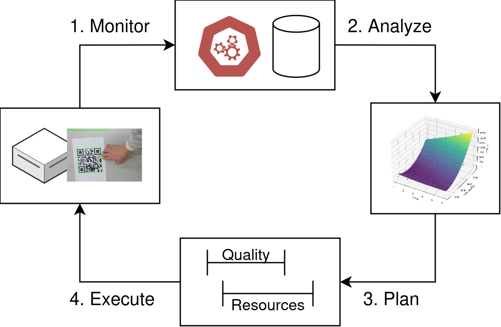

# Distributed Intelligence in the Computing Continuum

This tutorial describes a complete feedback cycle for an adaptive stream processing service that optimizes its performance throughout evolving requirements. The core phases of this cycle, following the traditional MAPE-K loop, are:

1. **Monitor**: Collect service telemetry
2. **Analyze**: Regression analysis of structural knowledge
3. **Plan**: Intent-based inference
4. **Execute**: Service scaling

Note that this abstract cycle can be implemented through various technologies and the ones presented in this tutorial present only one of many possibilities.



To reduce the experimental overhead of this tutorial, we do not actually run any physical services; instead, we operate on a prerecorded dataset that tracks the service behavior during runtime. Interested participants can find the complete experimental platform in this [repository](github.com/borissedlak/elastic-workbench).

## Setup

Optionally, create a new Python virtual environment:

```bash
python3 -m venv .venv
source .venv/bin/activate
```


Install the project dependencies:

```bash
pip install -r requirements.txt
```